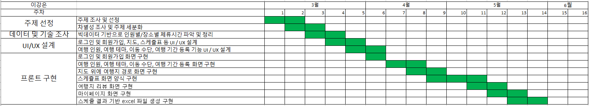
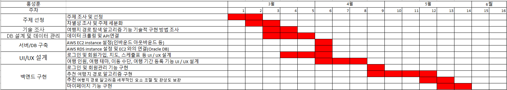
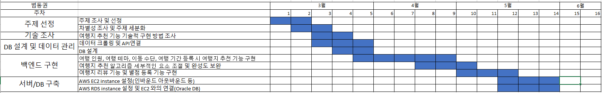

# Capstone_The_Simplest_Trip_Planner
## 2023-1 중앙대학교 캡스톤디자인 프로젝트
### STP 조
--------------------
### 목차

[0. 팀원 소개](#0-팀원-소개)

[1. 서비스 소개](#1-서비스-소개)

[2. 기술 스택](#2-기술-스택)

[3. 스케줄](#3-스케줄)

--------------------------

## 0. 팀원 소개
* 범동권 (20175368) :  백엔드 서버 구축 및 배포, DB 서버 설계 및 배포, TourAPI 연동, JWT 토큰 기반 로그인 기능 구현
* 이강은 (20173318) :  프론트엔드 UI/UX 디자인, Tmap 및 kakao map 프론트에 연동, Backend와의 통신 구현, 사용자 입력 기반 POST 요청 데이터 생성 구현
* 홍성훈 (20185832) :  ChatGPT API 연동 및 fine-tuning, GPT 응답 parser 구현, 음식점 데이터 크롤링 및 정규화

-----------
## 1. 서비스 소개

> AI기반 국내 여행장소, 일정, 경로 추천 서비스

유저의 간단한 정보 입력을 통해 여행 성향을 파악하고 AI를 통해 여행지를 추출 후 경로 추천을 하여 여행자의 전 여정을 계획해주는 웹 서비스입니다. 

기존에 여행지 추천 어플리케이션은 여러 개 있었지만, 일정과 경로를 추천해주는 서비스는 1개 밖에 없었고 그마저도 기간과 장소에 매우 제한적인 서비스였습니다.
이에, 이 부분에서의 불편함을 없애고 편리성을 극대화하기 위해 AI기반 국내 여행장소, 일정, 경로 추천 서비스를 제공하기로 하였습니다.

### 1.1. 서비스 대상

* **시각장애인 활동지원사**

  전맹인 시각장애인에게 점자 교육을 제공하고자 하지만 점자에 대한 지식이 많지 않은 활동지원사, 가족 등 

* **저시력 시각장애인**

  사물의 유무 정도는 분간할 수 있지만 시력이 낮아 글자를 읽는 데에는 한계가 있어 점자를 배울 필요가 있는 저시력 시각장애인
  
* **실명 질환 환자**

  시력이 남아 있지만 백내장, 녹내장, 황반변성 등 시력을 점차 잃어가게 되는 질병에 걸린 진행형 시각장애인
  
  
  
### 1.2. 주요 기능

#### 1.2.1. 여행 스케쥴을 만들어 주는 기능

1. 사용자가 현재 위치와 여행할 장소(복수 선택 가능)를 입력하고 선택적으로 몇가지 설문조사에 응합니다.
2. 여행자의 성향을 파악하여 TourAPI에서 성향에 맞는 여러개의 여행지를 추천해줍니다.
3. 추천된 여행지 리스트에서 AI가 성향을 더욱더 반영하여 날짜별 추천 여행지를 반환합니다.
4. 알고리즘을 통해 최적의 동선을 추천하고 실시간 교통 정보를 반영하여 스케쥴을 제작합니다.

#### 1.2.2. 여행지 근처 식당 추천 기능

1. 가지고 있는 여행자의 성향을 통해 미리 추출해둔 식당 데이터에서 각 여행 스팟별 근처 식당을 찾아 추천해줍니다.

#### 1.2.3. 정보 관리 기능

1. 사용자는 회원가입을 통해 본 서비스를 이용할 수 있습니다.
2. 로그인을 통해 인증 토큰을 발급 받고 토큰을 통해 닉네임, 비밀번호를 변경 할 수 있습니다.

-----------

## 2. 기술 스택

### 2.1. 백엔드

* Spring

  1. Spring은 Java 기반의 오픈 소스 프레임워크로, 엔터프라이즈급 애플리케이션 개발에 많이 사용됩니다. Spring의 다양한 모듈과 기능은 개발 생산성을 높이고 유지 보수성을 개선하는 데 도움을 줍니다.

* Oracle DB

  1. Oracle은 대규모 데이터베이스 관리 시스템으로, 신뢰성과 성능이 뛰어나며, 기업의 데이터 요구 사항을 충족시킬 수 있습니다.

* MyBatis

  1. SQL 매핑 프레임워크로, 객체 지향 프로그래밍 언어와 관계형 데이터베이스 간의 상호 작용을 단순화합니다.
  2. SQL과 코드의 분리를 지원하여 유지 보수성을 향상시키고, 개발자가 직접 SQL 쿼리를 작성할 수 있어 유연성을 제공합니다.

* JWT

  1. JWT(Jason Web Token)는 클라이언트와 서버 간의 인증에 사용되는 토큰 기반의 인증 방식입니다.
  2. JWT는 정보를 암호화하여 안전한 인증을 제공하며, 분산 시스템에서의 확장성과 유연성을 갖고 있습니다.

### 2.2. 프론트엔드

* Node.js

  1. Node.js는 비동기 이벤트 기반 JavaScript 런타임으로, 빠른 속도와 확장성이 높은 웹 애플리케이션 개발에 적합합니다.
  2. 또한, React와 함께 사용하여 서버와 클라이언트 모두 JavaScript를 사용하여 개발할 수 있어 개발 생산성이 높아집니다.

* React

  1. React는 사용자 인터페이스(UI) 구축을 위한 인기 있는 JavaScript 라이브러리입니다.
  2. Node.js와 함께 javascript로 개발 할 수 있어 생산성이 높습니다.
  3. 컴포넌트 기반 아키텍처를 통해 재사용성이 뛰어나고 가독성이 좋으며, 가상 DOM을 활용하여 효율적인 렌더링을 제공합니다.

* AXIOS

  1. AXIOS는 브라우저와 서버 간의 HTTP 통신을 단순화하는 JavaScript 라이브러리입니다.
  2. 비동기 처리와 에러 핸들링 등 다양한 기능을 제공하며, React와 함께 사용하기 편리합니다.

### 2.3. 배포

* AWS EC2

  1. 서버에서 자동적으로 트래픽을 관리하기 때문에 사용이 효과적입니다.
  2. 실무에서 가장 널리 쓰이는 클라우드 컴퓨팅 서비스입니다.
  3. 목적에 따라 다양한 서비스와 라이브러리를 제공합니다.

### 2.4. 프로젝트 관리

* Github

  1. Github 환경에서 작업물을 실시간으로 공유하며 작업하였습니다. 
  2. 코드 수정 내용을 효과적으로 파악할 수 있어, 유동적으로 작업할 수 있습니다. 

----------

## 3. 스케줄

